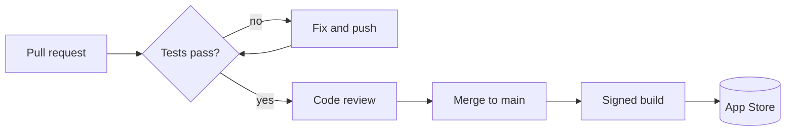
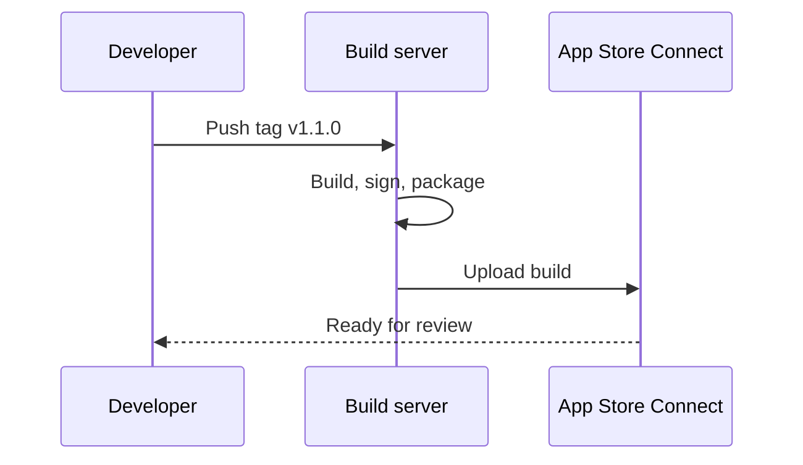

# Release process

Every change goes through the same pipeline, from pull request to the App Store.

```mermaid
flowchart LR
    PR[Pull request] --> CI{Tests pass?}
    CI -- no --> Fix[Fix and push]
    Fix --> CI
    CI -- yes --> Review[Code review]
    Review --> Merge[Merge to main]
    Merge --> Build[Signed build]
    Build --> Store[(App Store)]
```

```mermaid
sequenceDiagram
    participant Dev as Developer
    participant CI as Build server
    participant AS as App Store Connect
    Dev->>CI: Push tag v1.1.0
    CI->>CI: Build, sign, package
    CI->>AS: Upload build
    AS-->>Dev: Ready for review
```
